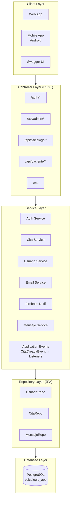
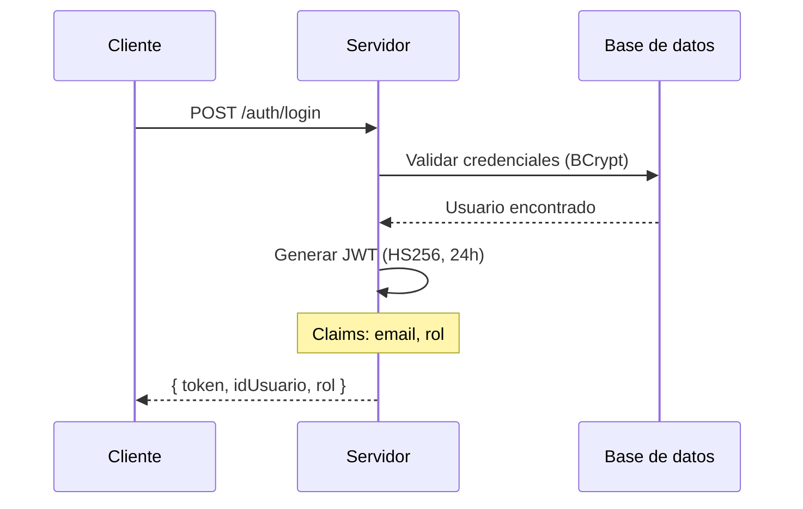
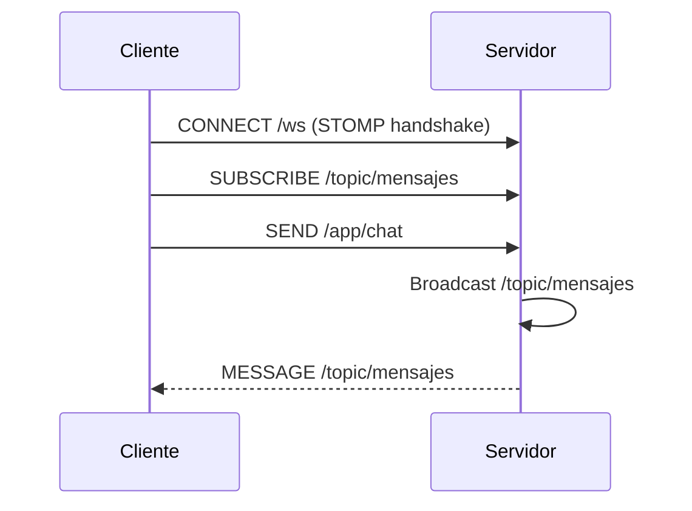
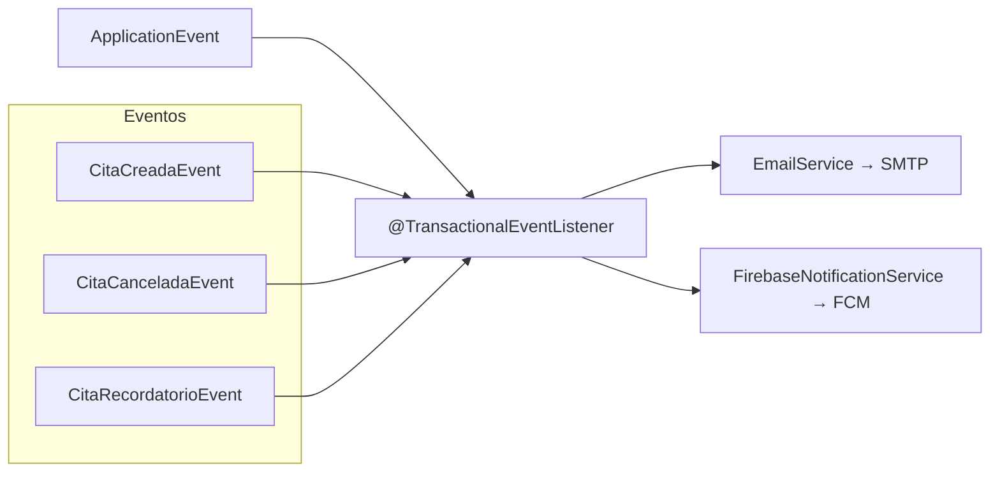
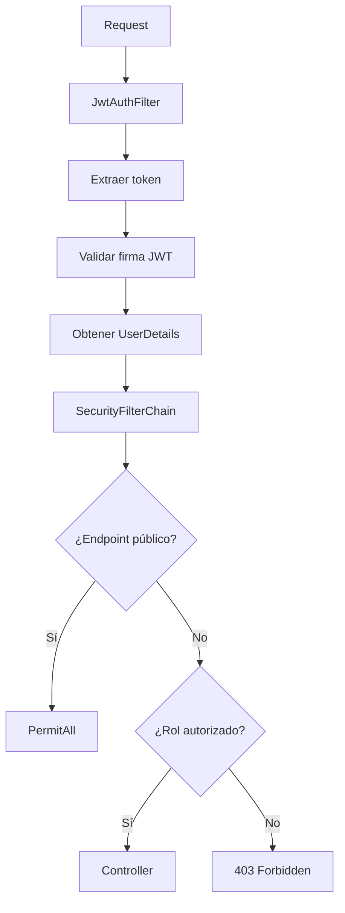
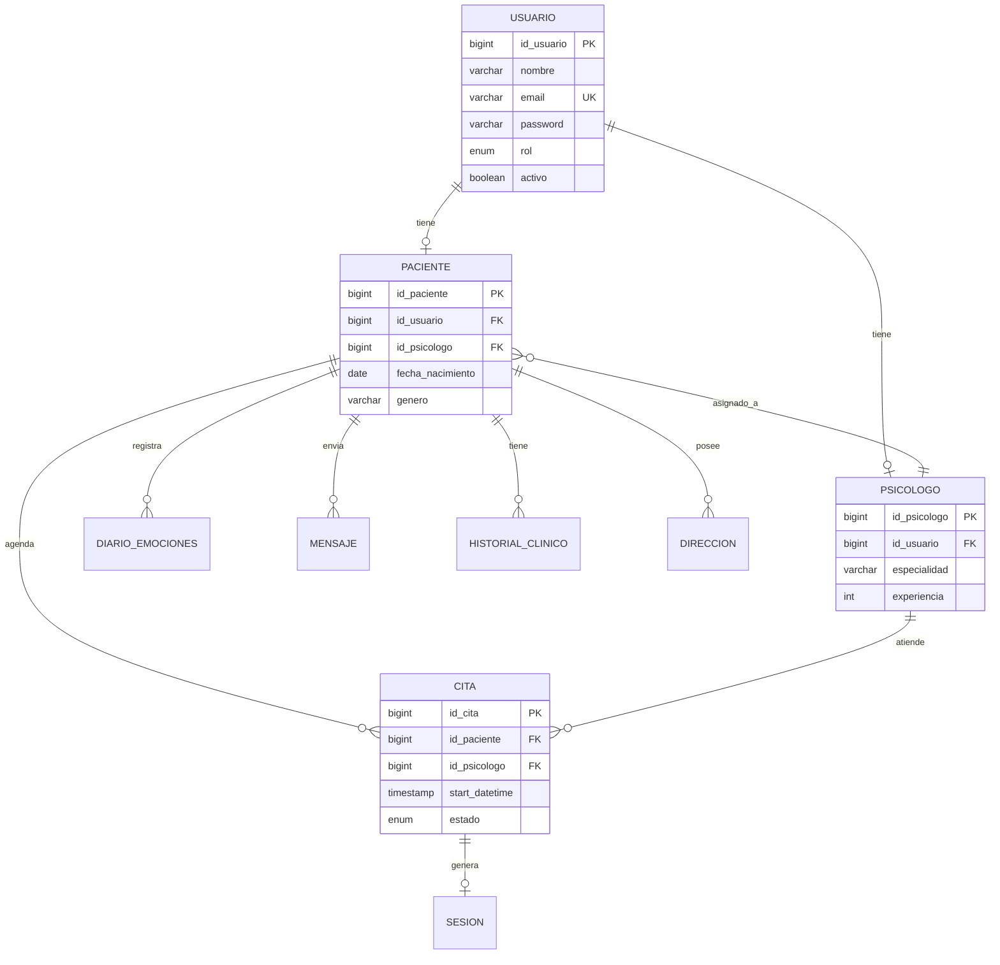

# Diagrama de Arquitectura

Esquema visual de la arquitectura del sistema.

---

## Diagrama de capas

---

## Flujo de autenticación

---

## Flujo WebSocket

---

## Flujo de notificaciones

---

## Flujo de seguridad

---

## Relación Entidad-Entidad (ER)

---

## Patrones implementados

| Patrón | Uso en Amani |
|--------|--------------|
| **Layered Architecture** | Controller → Service → Repository → Model |
| **Dependency Injection** | Spring @Autowired en todos los services |
| **DTO Pattern** | DTOs separados por rol y propósito |
| **Event-Driven** | @TransactionalEventListener para notificaciones |
| **Decorator** | FileStorageService wrap de Files.copy |
| **Strategy** | PasswordEncoder (BCrypt) |
| **Template Method** | Abstract classes con métodos comunes |
| **Singleton** | @Service y @Component por defecto |
