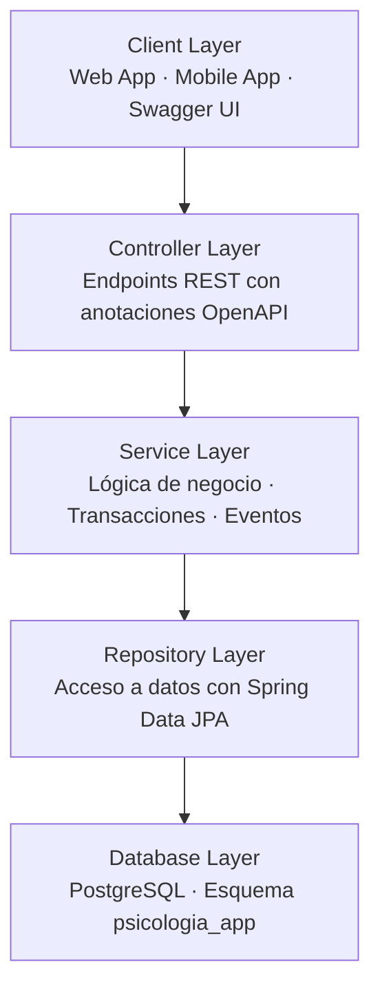
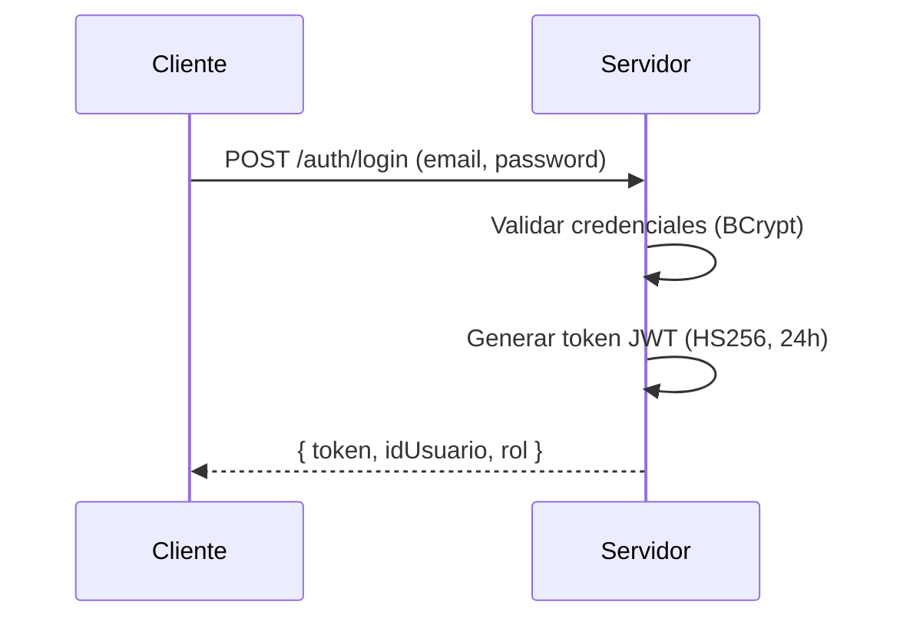

# Arquitectura del Sistema

Visión general de la arquitectura de la plataforma Amani.

---

## Patrón arquitectónico

La API sigue una **arquitectura por capas** con separación por roles:



---

## Capas detalladas

### 1. Configuration Layer

Ubicación: `src/main/java/com/amani/amaniapirest/configuration/`

| Clase | Responsabilidad |
|-------|-----------------|
| `SecurityConfig` | Configuración de Spring Security + JWT |
| `JwtUtil` | Generación y validación de tokens JWT |
| `JwtAuthFilter` | Filtro para validar tokens en requests |
| `WebSocketConfig` | Configuración WebSocket STOMP |
| `FirebaseConfig` | Cliente Firebase Admin SDK |
| `OpenApiConfig` | Configuración Swagger/OpenAPI |
| `ErrorResponse` | Estructura de respuestas de error |
| `GlobalExceptionHandler` | Manejo global de excepciones |

### 2. Controller Layer

Ubicación: `src/main/java/com/amani/amaniapirest/controllers/`

**Por rol:**

- `controladorAdministador/` — endpoints admin
- `controladorPsicologo/` — endpoints psicólogo
- `controladorPaciente/` — endpoints paciente

**Por funcionalidad:**

- `login/` — autenticación
- `chat/` — WebSocket
- `preguntasController/` — test inicial
- `profileController/` — fotos de perfil
- `situacionController/` — catálogo de situaciones

### 3. Service Layer

Ubicación: `src/main/java/com/amani/amaniapirest/services/`

**Servicios generales:**

- `UsuarioService` — gestión usuarios
- `EmailService` — envío de emails
- `FirebaseNotificationService` — notificaciones push
- `WebSocketPresenceTracker` — tracking de usuarios online

**Por rol:**

- `paciente/` — DiarioEmocionService, MensajeService, ProgresoEmocionalService
- `psicologo/` — MensajePsicologoService, PsicologoSelfService
- `serviceAdmin/` — DireccionAdminService, PacienteAdminService

**Servicios de login:**

- `serviciosLogin/AuthService` — login, registro, tokens

### 4. Repository Layer

Ubicación: `src/main/java/com/amani/amaniapirest/repository/`

Repositorios JPA: `UsuarioRepository`, `PacientesRepository`, `CitaRepository`, etc.

### 5. Models Layer

Ubicación: `src/main/java/com/amani/amaniapirest/models/`

Entidades JPA: `Usuario`, `Paciente`, `Psicologo`, `Cita`, `Sesion`, `Mensaje`, etc.

---

## Seguridad

### Autenticación JWT



### Roles y permisos

| Rol | Descripción | Endpoints |
|-----|-------------|-----------|
| `ADMIN` | Acceso completo | `/api/admin/**` |
| `PSICOLOGO` | Gestión clínica | `/api/psicologo/**` |
| `PACIENTE` | Acceso propio | `/api/paciente/**` |

### Endpoints públicos

- `POST /auth/login`
- `POST /auth/register-paciente`
- `GET /api/situaciones`
- `GET /api/psicologo/pacientes/*/psicologo` (pacientes solo)
- `/docs/**`, `/v3/api-docs/**`, `/swagger-ui/**`

---

## Event-Driven Architecture

Patrón usado para notificaciones: `@TransactionalEventListener`

### Eventos

| Evento | Descripción | Listeners |
|--------|-------------|-----------|
| `CitaCreadaEvent` | Nueva cita creada | Email, Push |
| `CitaCanceladaEvent` | Cita cancelada | Email, Push |
| `CitaRecordatorioEvent` | 24h antes de cita | Email |
| `UsuarioRegistradoEvent` | Nuevo usuario registrado | Email |

### Patrón de uso

```java
// En el service
eventPublisher.publishEvent(new CitaCreadaEvent(this, cita));

// En el listener
@TransactionalEventListener(phase = TransactionalEventListenerPhase.AFTER_COMMIT)
public void onCitaCreada(CitaCreadaEvent event) {
    emailService.enviarCitaCreada(event.getCita());
}
```

---

## WebSocket (STOMP)

### Configuración

- Endpoint: `/ws`
- Broker: `/topic`, `/queue`
- Prefijo apps: `/app`

### Usos

1. **Mensajería en tiempo real** entre usuarios
2. **Notificaciones push** (si no online → Firebase)
3. **Estado de sesión** (online/offline tracking)

---

## Base de datos

PostgreSQL con esquema `psicologia_app`.

Tablas principales:

- `usuarios` — cuenta de usuario
- `pacientes` — perfil paciente
- `psicologos` — perfil psicólogo
- `citas` — agendas y citas
- `sesiones` — sesiones de terapia
- `diario_emociones` — registro diario
- `mensajes` — chat
- `historial_clinico` — historial médico

Ver: [Base de datos](base-de-datos.md)
